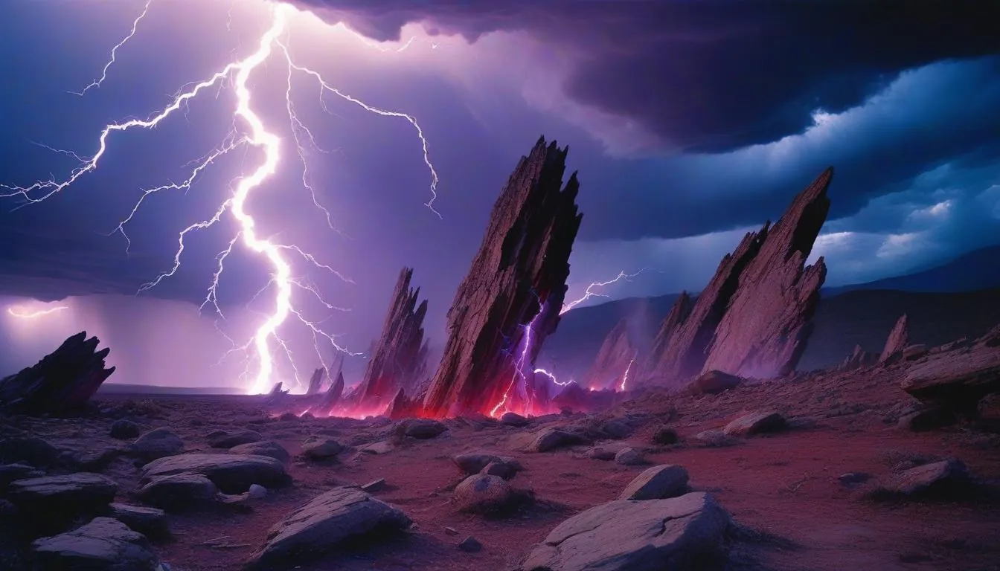
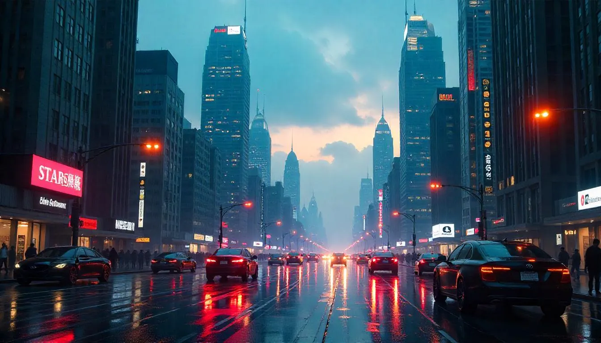
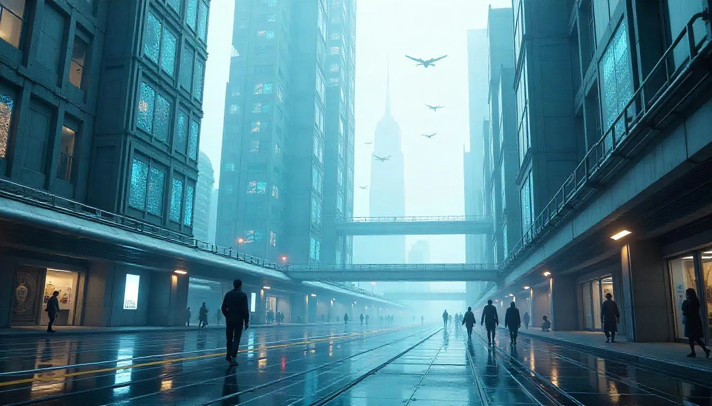

  <a href="/2025-4-16-Arcanum-Caedis.md" class="arcana-card lazy-bg arcanum" style="background-image: url('assets/img/Arcanum_mini.webp');" data-bg="assets/img/Arcanum.webp" aria-label="Explora el mundo de Arcanum Caedis, lleno de magia y secretos">
    <h2>Arcanum Caedis</h2>
    
  </a>

  <a href="/blog/puestoavanzada" class="arcana-card lazy-bg tecnocracia" style="background-image: url('assets/img/PuestoAvanzada_mini.webp');" data-bg="assets/img/PuestoAvanzada.webp" aria-label="Descubre el Puesto de Avanzada, bastión tecnocrático">
    <h2>Puesto de Avanzada</h2>
    
  </a>

  <a href="/blog/concordia" class="arcana-card lazy-bg hermeticos" style="background-image: url('assets/img/Concordia_mini.webp');" data-bg="assets/img/Concordia.webp" aria-label="Explora Concordia, la ciudad mágica de los Herméticos">
    <h2>Concordia</h2>
    
  </a>

  <a href="/blog/tierra" class="arcana-card lazy-bg tierra" style="background-image: url('assets/img/Tierra_mini.webp');" data-bg="assets/img/Tierra.webp" aria-label="La Tierra, un lugar donde magia y tecnología coexisten">
    <h2>La Tierra</h2>
    
  </a>

  <a href="/explorar" class="btn-arcano text-lg">Explorar el Plano</a>

